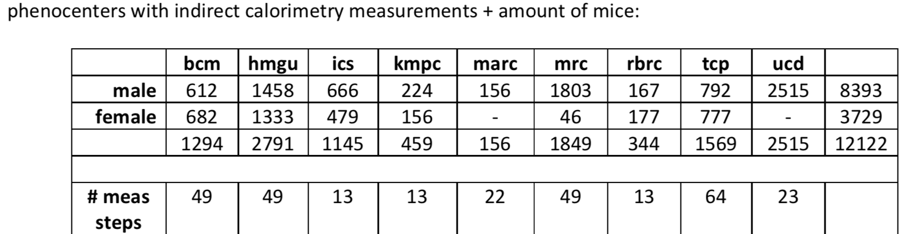
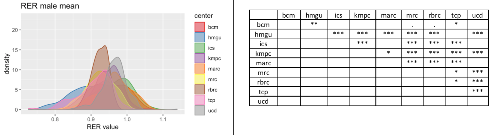
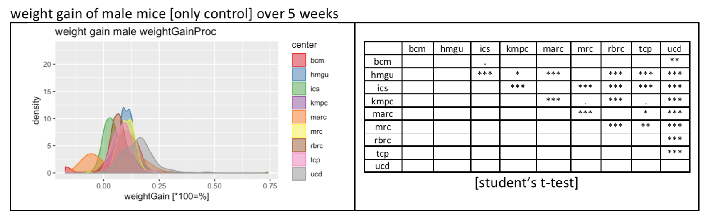
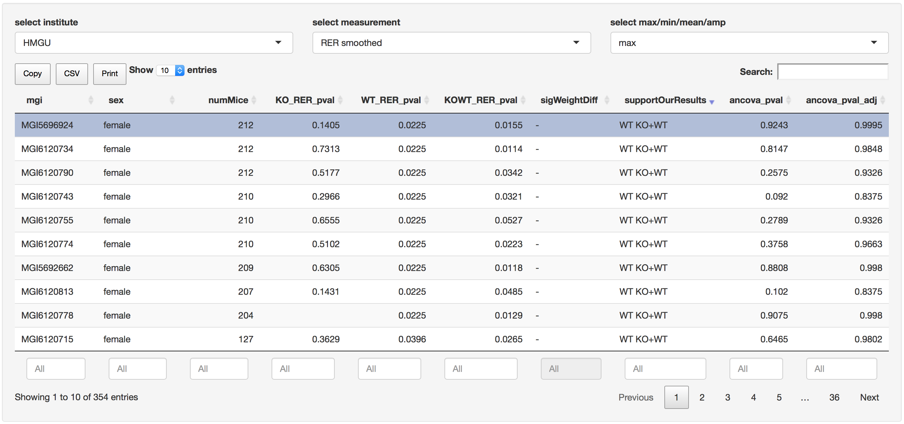
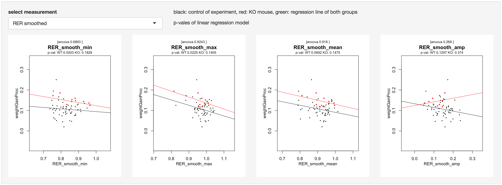
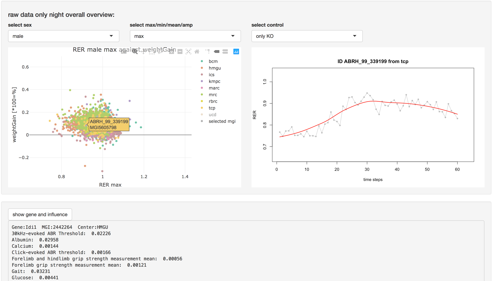

# impc_calorimetry_analysis
simple shiny app to compare indirect calorimetry data from IMPC

the goal was to check a big cohort of controls if we see certain suscpicious effects.
(please ask if you would like the data necessary to run this tool)

it allows automatic selection of the mouse strain, the center and feature. possible to compare with the according control mice and shows their relation to weight gain with certain selected features from the indirect calorimetry data.
additionally it is possible to select individual samples and to see the impact of the knock-out type.

---

whole analysis failed because measurement time was way to short (after acclimatisation about 12 hours). although the calorimetry measurement should be calibrated equally across centers, there is a lot of variance in the samples:

 

---

## R shiny app to analyse in more detail

